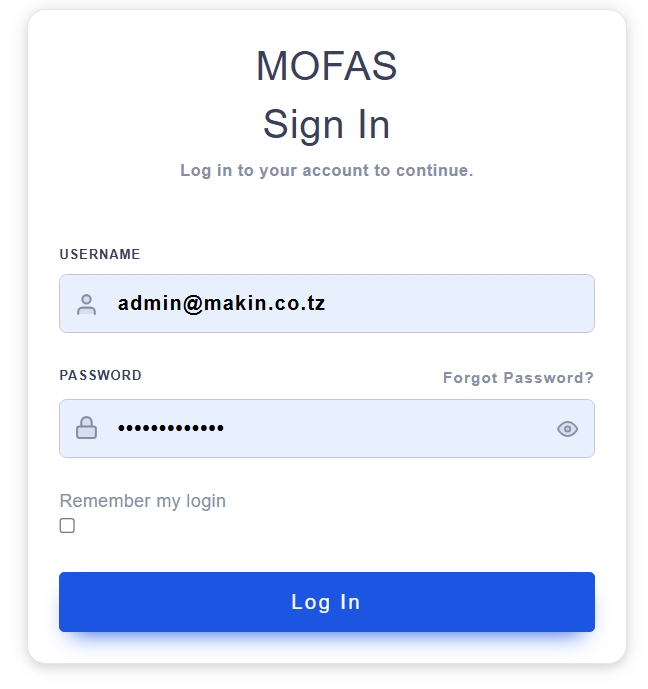
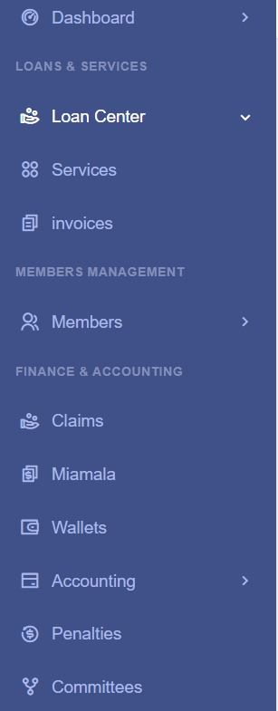
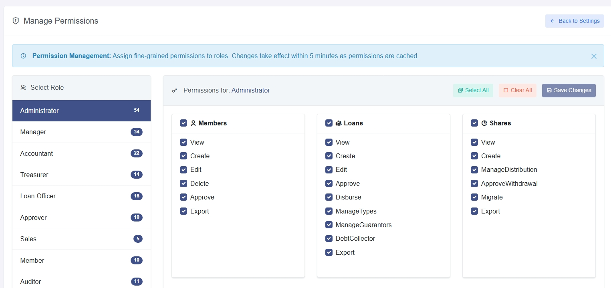
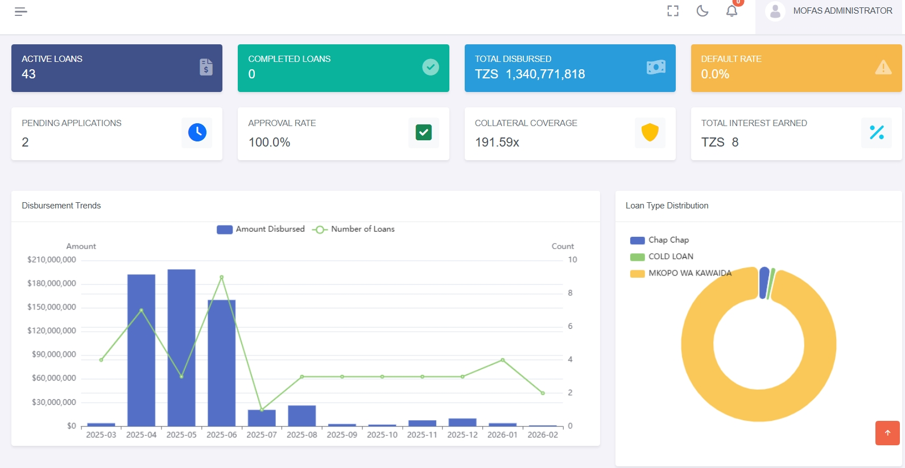
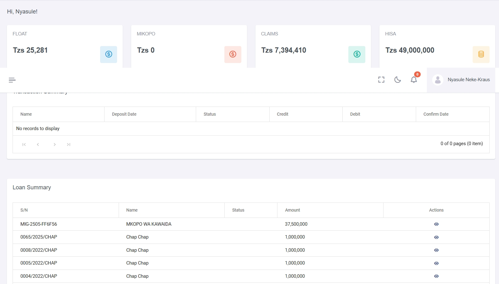

# MOFAS User Manual

Version: 1.0 (Draft)

Date: March 5, 2026

Product: MOFAS (Makini Women Group Financial Application)

Audience: End Users and Administrators

Language: English

---

## Table of Contents

1. [Introduction](#1-introduction)
2. [Getting Started](#2-getting-started)
3. [Roles and Permissions](#3-roles-and-permissions)
4. [Dashboard](#4-dashboard)
5. [Member Management](#5-member-management)
6. [Loan Management](#6-loan-management)
7. [Shares and Equity](#7-shares-and-equity)
8. [Finance and Accounting](#8-finance-and-accounting)
9. [Budgeting](#9-budgeting)
10. [Sales and Invoicing](#10-sales-and-invoicing)
11. [Inventory Management](#11-inventory-management)
12. [Purchases](#12-purchases)
13. [Products and Catalog](#13-products-and-catalog)
14. [Events and Training](#14-events-and-training)
15. [Uwajibikaji (Accountability)](#15-uwajibikaji-accountability)
16. [Reports and Analytics](#16-reports-and-analytics)
17. [Administration and Settings](#17-administration-and-settings)
18. [Contracts and Marketing](#18-contracts-and-marketing)
19. [Mobile Access](#19-mobile-access)
20. [Troubleshooting and FAQ](#20-troubleshooting-and-faq)
21. [Glossary](#21-glossary)
22. [Appendix A: Role Guide](#appendix-a-role-guide)
23. [Appendix B: Common Document Types](#appendix-b-common-document-types)
24. [Appendix C: Common Statuses](#appendix-c-common-statuses)

---

## 1. Introduction

MOFAS is a web-based financial and member operations platform for cooperative organizations. It supports day-to-day workflows including member onboarding, loans, shares, accounting, events, budgeting, and reporting.

### 1.1 Core Capabilities

- Membership lifecycle management
- Loan origination, approval, disbursement, repayment, and penalties
- Share contributions and profit distribution
- Finance and accounting operations
- Wallet operations (`Miamala`)
- Sales, invoicing, and payments
- Service operations
- Events and attendance tracking
- Role-based access and permission-based security

### 1.2 Typical Users

- Administrators, owners, managers, and accountants
- Specialized officers such as treasurers, loan officers, approvers, and committee users
- Members using self-service pages

---

## 2. Getting Started

### 2.1 Accessing the System

1. Open the MOFAS web URL provided by your administrator.
2. Sign in using the username, password, or sign-in method provided by your administrator.
3. After login, the application routes you to your default dashboard.

### 2.2 First Login Checklist

1. Confirm your profile details.
2. Confirm your role assignment.
3. Review sidebar menu sections available to your account.
4. Change password or security settings if required by policy.

### 2.3 Navigation Basics

The sidebar is permission-aware. Common sections include:

- `Dashboard` or `Home`
- `Loans & Services`
- `Members Management`
- `Finance & Accounting`
- `Planning & Events`
- `Uwajibikaji & Guarantees`
- `Reports & Analytics`
- `Settings`

### 2.4 Role-Based Navigation Click Paths

Use these menu paths after login:

| Role | Click Path |
|---|---|
| Administrator | `Dashboard` -> `Members Management` -> `Finance & Accounting` -> `Reports & Analytics` -> `Settings` |
| Accountant | `Dashboard` -> `Finance & Accounting` -> `Budgets` -> `Reports & Analytics` |
| Loan Officer | `Loans & Services` -> `Loan Center` -> `New Loans` or `Open Loans` |
| Approver | `Loans & Services` -> `Loan Center` -> open an item -> approve or reject |
| Member | `Home` -> `My Loans` -> `My Services` |
| Secretary (`Katibu`) | `Members Management` -> `Planning & Events` -> `Reports & Analytics` |

---

## 3. Roles and Permissions

MOFAS controls access by role. What you can see and do depends on the role assigned to your account.

### 3.1 Common Roles

- Administrator
- Manager
- Accountant
- Treasurer
- Loan Officer
- Approver
- Sales User
- Member
- Auditor
- Zone Manager
- Ukaguzi
- Katiba
- Uwajibikaji
- Events User
- Katibu
- Budgeting User

### 3.2 Permission Modules

- Members
- Loans
- Shares
- Financials
- Reports
- Settings
- Users
- Uwajibikaji
- Budgeting
- Events

Permission totals by module:

| Module | Permission Count |
|---|---:|
| Members | 6 |
| Loans | 9 |
| Shares | 6 |
| Financials | 8 |
| Reports | 3 |
| Settings | 3 |
| Users | 3 |
| Uwajibikaji | 6 |
| Budgeting | 4 |
| Events | 6 |
| Total | 54 |

### 3.3 Role Access Guide

| Role | Typical Scope |
|---|---|
| Administrator | Full access to all major areas |
| Manager | Members, loans, shares, reports, events, and selected review pages |
| Accountant | Finance, reports, budgeting, and selected review pages |
| Treasurer | Wallets, expenses, payments, and financial reporting |
| Loan Officer | Loan processing and selected member and reporting pages |
| Approver | Approval actions for loans, members, and claims |
| Sales User | Sales work plus limited visibility into related records |
| Member | Own profile, own loans, and own services |
| Auditor | Broad read-only access and reporting |
| Zone Manager | Zone-based member and loan visibility |
| Ukaguzi | Oversight, review, and reporting with selected extra access |
| Katiba | Governance-related settings, member views, and reports |
| Uwajibikaji | Accountability tasks with selected member and report access |
| Events User | Event management and related follow-up actions |
| Katibu | Member, events, and reporting work |
| Budgeting User | Budget preparation and selected finance and report access |

### 3.4 Practical Access Guidance

- Administrators have the widest access.
- Members mainly see their own information and services.
- Approvers focus on review and approval steps.
- Treasurers focus on wallets, expenses, and financial review.

---

## 4. Dashboard

### 4.1 Privileged Dashboard

Privileged users can access:

- `My Profile`
- `Financial Summary`
- `Loan Summary`

### 4.2 Member Dashboard

Members see a simplified home dashboard and personal service shortcuts.

### 4.3 Recommended Daily Review

1. Open dashboard summary cards.
2. Review pending approvals or overdue items.
3. Check key financial indicators.

### 4.4 Role-Based Steps

1. `Admin/Manager`: Open `Dashboard` -> select `Financial Summary` -> review loan and cash indicators.
2. `Accountant/Treasurer`: Open `Dashboard` -> cross-check totals with `Finance & Accounting` summaries.
3. `Member`: Open `Home` -> review personal loan status and service shortcuts.

---

## 5. Member Management

### 5.1 Membership Applications and Activation

1. Open `Members Management`.
2. Review `Membership Applications`.
3. Validate profile and required attachments.
4. Approve via `Member Activation` if authorized.

### 5.2 Manage Members

- Search and filter members
- Update member demographic details
- Track `Ceased Members`
- Record cessation reason where applicable

### 5.3 Heirs, Claims, and Endorsements

- Register heirs/beneficiaries
- Process member claims
- Track members and loans guaranteed by a member

### 5.4 Role-Based Procedure

1. `Admin/Manager`: `Members Management` -> `Membership Applications` -> open profile -> review details -> approve or return.
2. `Approver`: `Members Management` -> `Member Activation` -> review documents -> activate member.
3. `Member`: `My Services` -> open your profile -> update your details and related records.

### 5.5 Member Profile Workspace (Primary User Surface)

The member profile page is the main workspace for day-to-day member activities.

#### 5.5.1 Profile Header Banner

The top of every member profile displays a persistent header with key identity and financial data:

- **Member Photo Placeholder**: default avatar image
- **Member Name and Type**: full name in white text, member type below (e.g., Ordinary, Associate)
- **Country and Profession**: displayed as location and occupation badges
- **Float**: wallet balance shown in short number format (for example, "1.5M")
- **Hisa**: total share balance
- **Edit Profile** button: opens the profile update form

#### 5.5.2 Profile Tabs

The profile contains 10 tabs, each with a different purpose:

| Tab Name | Purpose |
|---|---|
| Overview | Status, personal information, charts, and membership actions |
| Warithi | Heir and beneficiary management |
| Taarifa za Bank | Bank account details |
| Claims | Financial claims |
| Miamala | Wallet transactions such as deposits, transfers, credits, and debits |
| Hisa | Share purchases, allocations, and withdrawal requests |
| Jamii | Jamii contributions and allocations |
| Mikopo | Loans, loan applications, and loan history |
| Ankara | Invoices, downloads, and wallet payments |
| Faini | Penalties, filters, and payment actions |

Information loads as you move between tabs so the page stays easier to use.

### 5.6 Overview Tab

The Overview tab is the default active tab and contains three primary areas:

#### 5.6.1 Membership Status Card

Displays the member's current status as a color-coded button/badge:

| Status | Color |
|---|---|
| `Applied` | Blue |
| `UnderReview` | Gray |
| `Active` | Green |
| `Inactive` | Red |
| `Ceased` | Red |

Below the status, the **Cease Membership** or **Rescue Membership** button is conditionally displayed:
- `Cease Membership` (red): visible when status is NOT `Ceased`
- `Rescue Membership` (blue/info): visible when status IS `Ceased`

#### 5.6.2 Personal Information Card

Displays a borderless table of member details:

| Field | Description |
|---|---|
| Registration | Member registration number |
| Full Name | Member full name |
| Mobile | Main mobile number |
| Phone | Secondary phone number |
| E-mail | Email address |
| Location | Country or location |
| DoB | Date of birth |
| Joining Year | Year the member joined |

#### 5.6.3 Charts Section (Home)

The right side of the Overview tab can show up to three charts:

1. **Share Distribution**: Monthly share movement.
2. **Financial Activity**: Recent deposits and disbursements.
3. **Loan Status**: Number of loans in each status.

If information is temporarily unavailable, the chart area shows a message instead.

### 5.7 Warithi (Heirs) Tab

**Title**: "Warithi"

**Actions**:
- `Ongeza Mrithi` (Add Heir) button: opens the heir form.

**Main Columns**:

| Column | Description |
|---|---|
| Full Name | Heir's full name |
| Email | Heir's email address |
| Phone | Heir's phone number |
| Relationship | Relation to the member (e.g., Spouse, Child, Parent) |
| Address | Heir's physical address |
| Actions | Edit or delete |

**Toolbar**: Excel Export (exports as "Member Heir List.xlsx").

### 5.8 Taarifa za Bank (Bank Details) Tab

**Title**: "Bank Details"

This is a simple table (not a grid) showing a single bank account:

| Field | Description |
|---|---|
| Bank Name | Name of the member's bank |
| Account Number | Member bank account number |
| Branch | Bank branch |

**Actions**:
- `Add | Update Bank Detail` button: opens the bank details form.

### 5.9 Claims Tab

**Title**: "Financial Claims"

**Actions**:
- `New Claim` button: opens the claim form.

**Main Columns**:

| Column | Description |
|---|---|
| Name | Account/claim name |
| Date | Claim date |
| Status | Status badge (Pending, Completed, Approved, etc.) |
| Amount | Claim amount |
| Pay Account | Source account for payment |
| Payment Date | Date payment was processed |
| Actions | Edit or delete |

**Toolbar**: Excel Export (exports as "Member Claims History.xlsx").

### 5.10 Miamala (Wallet Transactions) Tab

**Title**: "Miamala"

This tab shows wallet transactions and related money movements.

**Action Buttons**:
- `Transfer Float`: opens the transfer form.
- `New Deposit`: opens the deposit form.

**Main Columns**:

| Column | Description |
|---|---|
| Name | Transaction account name |
| Deposit Date | Date of the transaction |
| Description | Free-text description |
| Type | Transaction category |
| Status | Badge (Pending, Completed, Approved, etc.) |
| Credit | Incoming amount |
| Debit | Outgoing amount |
| Confirm Date | Date the transaction was confirmed |
| Actions | View details or delete |

**Delete restriction**: Delete is only available for deposits that are still pending or confirmed. Other transaction types cannot be deleted here.

**Toolbar**: Excel Export (exports as "Member Transaction History.xlsx"), Search bar (real-time filtering).

### 5.11 Hisa (Shares) Tab

**Title**: "Hisa"

**Action Buttons**:
- `Nunua Hisa`: opens the share purchase form. **Time-restricted** (16th-5th only).
- `Hisa Claim`: opens the share withdrawal form.

**Main Columns**:

| Column | Description |
|---|---|
| Name | Share type name (e.g., "Share F", "Share L") |
| Date | Purchase date |
| Total Qty | Total shares purchased |
| Available | Available shares (green badge) |
| Withdrawn | Withdrawn shares (red badge with date, or dash if zero) |
| Price | Per-share price |
| Total Value | `Quantity × Price` |
| Available Value | Value of remaining shares (bold) |
| Status | `Active` (green, when Paid), `Partially Withdrawn` (yellow), `Fully Withdrawn` (gray) |
| Invoice# | Associated invoice number |
| Actions | Allocation (view monthly allocation), Delete |

**Allocation action**: Opens a small window showing monthly share allocations.

**Delete action**: Only available during the purchase window (16th to 5th). Shows detailed impact:
- Deletes the share purchase
- Deletes the associated invoice
- Deletes related transactions and journal entries
- Returns the share value to the member's wallet

If delete is attempted outside the allowed period, a warning message explains the restriction.

**Toolbar**: Excel Export (exports as "Member Hisa History.xlsx").

Authorized users may also see share redistribution actions.

### 5.12 Jamii Tab

**Title**: "Jamii"

**Action Buttons**:
- `Make Payment` button: opens the Jamii payment form. **Time-restricted** (16th-5th only).

**Main Columns**:

| Column | Description |
|---|---|
| Number | Jamii record reference number (tarakim) |
| Date | Issue date |
| Amount | Total payment amount |
| Status | Badge (Pending, Completed, Paid, etc.) |
| Actions | View (allocation details), Delete |

**View action**: Shows monthly Jamii allocations in a small window with the total amount.

**Delete action**: Requires confirmation. After a successful delete, the page refreshes.

**Toolbar**: Excel Export (exports as "Member Jamii History.xlsx"), Search bar.

### 5.13 Mikopo (Loans) Tab

**Title**: "Mikopo"

**Action Buttons**:
- `Omba Mkopo` (Apply Loan): opens the full loan application form (see Section 6.14). **Not time-restricted**.

**Main Columns**:

| Column | Description |
|---|---|
| # | Loan number |
| Name | Loan type name |
| Status | Badge (uses full status template — see 5.16) |
| Amount | Requested loan amount |
| Disbursed Amount | Amount actually disbursed |
| Disbursement Date | Date of disbursement |
| Processing Fee | Fee charged on the loan |
| Monthly Repayment Amount | Monthly installment value |
| Actions | View or delete |

**Delete action**: After a successful delete, the loans tab refreshes.

**Toolbar**: Excel Export (exports as "Member Loan History.xlsx").

### 5.14 Ankara (Invoices) Tab

**Title**: "My Invoices"

**Main Columns**:

| Column | Description |
|---|---|
| Invoice # | Invoice number (clickable, opens details) |
| Date | Invoice date |
| Description | Invoice description |
| Amount | Total invoice amount |
| Status | Badge: `Pending` (yellow), `Completed` (green), `Overdue` (red) |
| Due Date | Payment due date |
| Actions | View, Download, Pay (conditional) |

**Action Buttons per Row**:
1. **View**: Opens invoice details.
2. **Download**: Opens the invoice PDF.
3. **Pay from Wallet** (green outline, only for non-Completed invoices): Triggers wallet payment flow:
   - Checks wallet balance against invoice amount
   - If insufficient: shows "Insufficient Balance" warning
   - If sufficient: shows confirmation with Invoice #, Amount, Current Balance, and Balance After Payment
   - On confirm: completes the payment
   - On success: shows payment confirmation and refreshes the invoices tab

**Toolbar**: Excel Export (exports as "Member Invoices History.xlsx").

### 5.15 Faini (Penalties) Tab

The penalties tab is a full management workspace with statistics, filtering, and operational actions.

#### 5.15.1 Summary Cards

Four summary cards display at the top:

| Card | Icon Color | Metric |
|---|---|---|
| Total Penalties | Blue | Count of all penalties |
| Unpaid Amount | Yellow | Sum of unpaid penalty amounts (TZS) |
| Paid Amount | Green | Sum of paid penalty amounts (TZS) |
| Total Amount | Cyan | Sum of all penalty amounts (TZS) |

Cards update dynamically when data loads or filters change.

#### 5.15.2 Filtering

Two filter dropdowns + Apply button:

- **Filter by Type**: Dropdown showing available penalty types
- **Payment Status**: `All`, `Paid`, `Unpaid`
- **Apply Filters** button: reloads the grid with selected filters

#### 5.15.3 Penalties Table

The penalties table shows:

- Checkbox (for bulk selection)
- Type
- Amount (sortable)
- Date (sortable)
- Status (Paid/Unpaid badge)
- Paid Date (sortable)
- Actions

**Table features**: Sorting and export options.

**Row Actions**:
- **View**: Opens penalty details
- **Pay**: Records penalty payment (wallet-aware — checks balance first, confirms before posting)
- **Delete** (Admin/Treasurer only): Deletes individual penalty with confirmation

**Bulk Actions** (Admin/Treasurer only):
- **Select All** checkbox: toggles all non-disabled checkboxes
- **Delete Selected** button: bulk-deletes checked penalties with count confirmation

#### 5.15.4 Wallet-Aware Penalty Payment Flow

1. The system checks the current wallet balance.
2. If the balance is sufficient, it shows a confirmation with the penalty details and the balance after payment.
3. If the balance is insufficient, it shows a warning.
4. After confirmation, the payment is completed and the penalties list refreshes.

#### 5.15.5 Role-Based Visibility

- `Admin` and `Treasurer` roles see: Delete individual, Delete Selected (bulk), and all standard actions.
- Other roles see: View and Pay only. Delete buttons are hidden.

### 5.16 Loan Status Badges Reference

The profile uses a shared status template across Loans, Claims, Transactions, and Jamii grids. The full set of status badges:

| Status | Badge Style | Display Text |
|---|---|---|
| `Pending` | Yellow (warning) | Pending |
| `Approved` | Green (success) | Approved |
| `FinalReview` | Gray (secondary) | Final Review |
| `Disbursed` | Cyan (info) | Disbursed |
| `Closure` | Cyan (info) | Pending Closure |
| `Ceased` | Yellow (warning) | Ceased |
| `Repaid` | Green (success) | Repaid |
| `Rejected` | Red (danger) | Rejected |
| `Defaulted` | Red (danger) | Defaulted |

### 5.17 Time-Window Rules on Member Profile

Some actions on the member profile are only available during specific dates and times.

**Restricted operations**:
- `Nunua Hisa` (Share Purchase) button on the Hisa tab
- `Make Payment` (Jamii Payment) button on the Jamii tab

**Not restricted**:
- `Omba Mkopo` (Loan Application) button on the Mikopo tab
- Share delete actions (these follow their own date rules)

**Allowed window**: From the **16th** to the **5th** of the month, after **1:00 AM**.

**Outside window behavior**:
- Buttons appear disabled
- A lock icon may appear on the button
- A message explains when the action will be available again
- If clicked, a warning message is shown

### 5.18 Membership State Change Operations

The Overview tab includes two membership status actions:

#### Cease Membership

1. Click `Cease Membership` (red button, visible when status is not `Ceased`).
2. Review the warning message carefully.
3. Confirm the action.
4. A success message is shown and the page reloads.

#### Rescue Membership

1. Click `Rescue Membership` (info button, visible only when status IS `Ceased`).
2. Review the confirmation message.
3. Confirm the action.
4. A success message is shown and the page reloads.

**Governance guidance**:
- Use cessation only with documented reason and governance approval.
- Use rescue only for approved reinstatement cases.
- Confirm resulting status change appears on the Membership Status card after reload.

---

## 6. Loan Management

### 6.1 Loan Lifecycle

1. Create loan application (`New Loans`).
2. Validate guarantor and eligibility rules.
3. Move through approval workflow.
4. Disburse approved loans.
5. Track repayment and penalties.
6. Close loan on full settlement.

### 6.2 Loan Queues

- New Loans
- Open Loans
- Completed Loans
- Rejected Loans

### 6.3 Loan Configuration

- Loan types
- Guarantor groups and requirements
- Processing fees
- Top-ups
- Migration utilities

### 6.4 ChapChap Loans

- Quick-loan product
- Separate payment operations and monitoring

### 6.5 Role-Based Procedure

1. `Loan Officer`: `Loans & Services` -> `Loan Center` -> `New Loans` -> open application -> validate guarantors -> submit for approval.
2. `Approver`: `Loans & Services` -> `Loan Center` -> `Open Loans` -> open pending item -> approve or reject.
3. `Treasurer/Authorized Disburser`: `Finance & Accounting` -> `Disbursements` -> execute disbursement -> confirm transaction reference.

### 6.6 Loan Summary Workspace (Primary Loan Manual Surface)

The loan summary page is the main workspace for reviewing loan details, disbursement, collateral, guarantors, payments, and penalties.

Primary areas in the page:

- Overview pane: loan financial summary and key status data
- Collateral tab: collateral listing and review actions
- Activities tab: timeline/operations history
- Penalties tab: conditional, appears for `Disbursed`, `Defaulted`, `Repaid`, and `Ceased` loans
- Disbursement window: review net disbursement details
- Receipt Method window: split disbursement between bank transfer and wallet credit
- Insurance Policy window: enter or update policy details for the loan

### 6.7 Loan Summary Financial Calculations

The page calculates disbursement values for review:

- `Gross Disbursement`: approved/top-up amount
- Deductions: settlement amount (top-up), processing fee, insurance fee
- `Net Disbursement`: gross minus deductions (floored at 0)

Manual instructions for operators:

1. Confirm gross amount matches approved loan value.
2. Confirm all deductions are expected and approved.
3. Verify the net disbursement amount before saving the receipt method.

### 6.8 Disbursement Method Procedure

Use the `Set Disbursement Method` window to split net disbursement correctly.

1. Open the receipt method window from the loan summary.
2. Select one or both methods: `Bank Transfer` and `Credit to Member Wallet`.
3. Enter amounts so the total equals net disbursement exactly.
4. If both methods are selected, use auto-calculation to allocate remainder.
5. Save and confirm the details were updated.

Validation behavior to document for users:

- Save is blocked if total method amount does not equal net disbursement.
- Alert area appears for mismatched totals.
- Existing preferences are loaded when the window opens.

### 6.9 Insurance Policy Procedure

From loan summary, operators can add or edit policy details:

1. Open the `Insurance Policy` window.
2. Provide insurer, policy number, start date, end date, coverage amount, and premium.
3. Ensure end date is after start date.
4. Save policy and refresh loan summary to confirm updates.

### 6.10 ChapChap Flexible Payment Procedure

The summary page supports three ChapChap payment actions:

- `Full`
- `InterestOnly` (rent principal for next month)
- `PrincipalOnly` (reduce outstanding principal)

Operator/member flow:

1. Choose payment type from schedule action.
2. Confirm prompt showing amount and intent.
3. Submit the payment and review the confirmation message.
4. Refresh page and verify schedule/loan balance changes.

Common validation messages:

- Insufficient wallet balance
- Amount exceeds remaining interest or principal
- Schedule already paid
- Loan type not eligible for flexible payment

### 6.11 Time-Window Rules on Loan Summary

Some loan restructuring actions are only available during specific dates and times.

- Restricted actions: extend loan, shorten loan, convert to normal.
- Allowed window: from the `16th` to the `11th` of the month, after `1:00 AM`.
- Always allowed (not restricted): top-up, disbursement, and cease-loan actions.

### 6.12 Collateral and Guarantor Review Actions

The summary page includes action buttons for collateral and guarantor decisions.

- Collateral actions: approve, reject, delete.
- Guarantor actions: accept, reject.

Recommended workflow:

1. Review supporting details in the collateral/guarantor row.
2. Run approve or reject with confirmation.
3. Verify status badge and activity trail update.

### 6.13 Loan Penalties Tab in Summary

When the penalties tab is available, it shows a summary of penalties for that loan.

Displayed data includes:

- Total penalties count
- Total penalty amount
- Paid penalty amount
- Unpaid penalty amount
- Monthly penalty breakdown rows

Operational actions:

1. Open penalties tab and wait for summary load.
2. Inspect unpaid penalties and due date/delay context.
3. Optionally mark specific penalties as paid with payment reference.

### 6.14 Loan Application — Complete Flow

The loan application page is the main form used to request a new loan. It shows the member's total shares for reference and guides the user step by step.

**Preconditions:**

- Member must be active and eligible for loan application.
- At least one loan type must be configured by administrators.
- You can access it from the member profile under the `Mikopo` tab by selecting `Apply Loan`.

### 6.15 Loan Application — Step-by-Step Procedure

1. **Access application form**: Navigate to the member's profile -> `Mikopo` tab -> click `Apply Loan`. The form displays the member's total share value at the top as reference (e.g., "Member Total Shares: Tsh 5,000,000.00").

2. **Select Loan Category**: Choose one of the three loan categories from the dropdown:
   - `Chap Chap` — Quick short-term loan product
   - `Cold Loan` — Specific product category
   - `Normal` — Standard loan product

3. **Select Loan Type**: After selecting a category, the loan type dropdown populates with available types for that category. Select the specific loan type.

4. **Select Application Method** (conditional): If the selected loan type supports emergency applications, an "Application Method" dropdown appears with options:
   - `Normal` — Standard processing timeline
   - `Emergency` — Expedited processing

5. **Enter Loan Amount**: Enter the requested amount. The system displays:
   - Minimum and maximum amount constraints based on the loan type
   - Real-time validation with warning/error messages if amount exceeds limits
   - Amount is auto-formatted with thousand separators for readability

6. **Enter Duration**: Enter repayment duration in months.
   - For single-month rate loans (e.g., ChapChap), duration is fixed at 1 month and the field is disabled.
   - Maximum duration is set per loan type configuration.
   - Real-time validation warns if duration exceeds the allowed maximum.

7. **Review Loan Summary**: As you enter amount and duration, the system calculates and displays a live summary:
   - Interest Rate (%)
   - Monthly Payment
   - Processing Fee
   - Total Interest
   - Total Repayment
   - Net Disbursed Amount (amount received after fees)
   - Insurance Fee

8. **Review Repayment Schedule**: Below the summary, a detailed repayment schedule table shows:
   - Payment Date
   - Payment Month
   - Payment Amount (principal + interest)
   - Principal portion
   - Interest portion
   - Remaining Balance

9. **Submit Application**: Click `Apply Loan` to submit. The system:
   - Validates all inputs
   - Submits the application
   - On success, displays a confirmation with the application number
   - Redirects to the Loan Summary page for the new loan

### 6.16 Loan Application — Validation Rules

The application enforces the following rules:

- Loan category and type must both be selected before submission.
- Amount must be > 0 and <= maximum amount for the loan type.
- Duration must be > 0 and <= maximum repayment duration.
- If amount or duration exceeds limits, the system auto-adjusts to maximum and shows a warning note.
- Single-month rate loans have duration locked to 1 month.
- A "Note" banner appears for single-month ChapChap loans: failure to repay on time may result in conversion to a normal loan with a higher interest rate.

### 6.17 Loan Application — Conversion to Normal Loan

For single-month loans that are not repaid on time, a conversion section is available:

1. Enter a new loan duration (1-60 months).
2. Click `Convert Loan` to restructure the outstanding balance as a normal loan.
3. Review the converted loan terms in the resulting summary.

### 6.18 Loan Top-Up — Overview

The loan top-up page allows eligible members to request additional funds on an existing disbursed loan. The top-up first settles the current outstanding balance and then creates a new larger loan.

**Preconditions:**

- The loan must be in disbursed/active status.
- The loan must be marked as eligible for top-up.
- Access via Loan Summary page -> Top-up action, or from member profile -> `Mikopo` tab -> top-up action.

### 6.19 Loan Top-Up — Current Loan Details

The top-up page displays the existing loan details for reference:

- **Loan Number**: The current loan identifier
- **Original Amount**: The initial loan amount
- **Outstanding Amount**: Current remaining principal balance
- **Paid Principal**: Amount of principal already repaid
- **Paid Interest**: Interest already paid on the loan

If the loan has existing **collaterals**, they are listed with:
- Type, Description, and Estimated Value (TZS)

If the loan has existing **guarantors**, they are listed with:
- Name, Contact, and Status (Approved/Pending badge)

### 6.20 Loan Top-Up — Request Procedure

1. **Enter Top-up Amount**: The minimum amount must be greater than or equal to the current outstanding amount. Enter the total new loan amount desired.
   - Amount field supports comma-formatted numbers for readability
   - Paste support strips non-numeric characters automatically

2. **Select Application Mode**:
   - `Normal` — Standard processing
   - `Emergency` — Expedited processing

3. **Enter Duration**: Set repayment duration in months (1 to maximum allowed by loan type).

4. **Calculate Schedule**: Click `Calculate Schedule` to preview the top-up. The system calls the server and returns:

   **Original Loan Settlement breakdown:**
   - Outstanding Principal
   - Current Month Interest
   - Previously Paid Interest
   - Total Interest Rate
   - Paid Duration (months)
   - Paid Period Interest Rate
   - **Settlement Amount** (total amount to close the old loan)

   **New Loan Details:**
   - Total Top-up Amount
   - New Interest Rate
   - Processing Fee
   - Insurance Fee
   - Monthly Payment
   - Total Interest
   - **Net Disbursement** (amount received after settlement + fees)

5. **Review Repayment Schedule**: A full schedule table displays:
   - Due Date
   - Principal portion
   - Interest portion
   - Monthly Payment
   - Principal Balance
   - Total Balance (decreasing)
   - Footer totals for principal, interest, and total payments

6. **Fees Info Bar**: At the top, a summary bar shows Processing Fee, Insurance Fee, Interest Rate, and Net Disbursed.

### 6.21 Loan Top-Up — Confirmation and Submission

1. After reviewing the schedule, click `Confirm and Submit Top-up Request`.
2. A confirmation dialog asks whether you want to continue.
3. On confirmation, the system submits the top-up request.
4. On success: displays success message and redirects to the new loan summary page.
5. **Cancel**: Click `Cancel` to reset the form and clear all calculated results.

### 6.22 Loan Top-Up — Validation Rules

- Top-up amount must be > 0 and >= outstanding amount.
- Duration must be between 1 and the maximum allowed months.
- Application mode must be selected before submission.
- Schedule must be calculated and reviewed before the confirm button is enabled.
- If the loan is not eligible for top-up, the form displays a warning: "This loan is not eligible for top-up."

---

## 7. Shares and Equity

### 7.1 Share Operations

- Share purchase posting
- Share history and balances
- Withdrawal request submission and approval

### 7.2 Profit Distribution

- Configure distribution period
- Allocate profits to eligible members
- Publish distribution reports

### 7.3 Migration

- Share migration tools for legacy or cycle transition cases

### 7.4 Role-Based Procedure

1. `Accountant/Admin`: Open share purchase entry and post member share contribution.
2. `Approver/Authorized Role`: `Finance & Accounting` -> `Share Withdrawals` -> validate request -> approve or reject.
3. `Manager`: Run share/profit distribution views and verify totals before publishing cycle output.

### 7.5 Share Purchase — Overview (Nunua Hisa)

The share purchase page is the main form for buying member shares. It supports yearly limits, multiple share types, and optional monthly allocation.

**Preconditions:**

- Member must be active.
- Member must have sufficient wallet balance ("Salio Lako" displayed at the top of the form).
- Access via member profile -> `Hisa` tab -> `Nunua Hisa` action.
- Purchase window must be open (16th to 5th of the month).

### 7.6 Share Purchase — Share Month and Purchase Window

The system uses a **16th-to-15th cycle** for share months:

- Each share month runs from the 16th of one month to the 15th of the following month.
- Example: "June 2025" share month runs from June 16th to July 15th.

**Purchase Window Rules:**

- **OPEN** (16th to 5th): Members can purchase shares for the previous share month and advance months.
- **CLOSED** (6th to 15th): Share purchasing is suspended. The form displays a notice but validation prevents current/past month purchases.

The form displays:
- Current Share Month name and date range
- Purchase Window status (`OPEN` or `CLOSED`) and descriptive message
- Payment alerts if the member has skipped payments in past months

### 7.7 Share Purchase — Fiscal Year and Limits

Shares operate on a fiscal year cycle. The form shows limits for both current and next fiscal years:

**Current Fiscal Year display:**
- Annual Limit (total allowed per year)
- Used (amount already purchased)
- Remaining (available amount)
- Progress bar showing percentage used (turns red when limit reached)

**Next Fiscal Year display:**
- Same structure as current year
- Becomes the primary target when current year limit is exhausted

**Monthly Limits:**
- Maximum 200 shares per month
- Maximum Tsh 2,000,000 value per month

**Fiscal Year Selection:**
- Radio buttons allow selecting `Current Fiscal Year` or `Next Fiscal Year`
- When current year limit is reached, an info note suggests purchasing for next fiscal year
- Purchase date must fall within the selected fiscal year

### 7.8 Share Purchase — Share Type Selection

The form displays all available share types with checkboxes:

1. **Select share types**: Check one or more share types (e.g., Share F, Share L). Each displays the share name and selling price.
2. **Enter quantity**: For each selected share type, enter the number of shares to purchase in the quantity field.
3. **View per-type amount**: The calculated cost (quantity × price) displays next to each share type.
4. **Remove shares**: Use the red trash button to deselect and clear a share type.
5. **Review totals**: Sub Total and Total are displayed at the bottom.

### 7.9 Share Purchase — Allocation Date

Select the allocation date:
- Date must be within the selected fiscal year period.
- If the date falls between the 16th and 5th, shares are allocated to the previous month.
- If the date falls between the 6th and 15th, shares are allocated to the current month.
- Date picker enforces min/max constraints based on fiscal year.

### 7.10 Share Purchase — Monthly Allocation (Ugawaji wa Hisa Kila Mwezi)

For advanced distribution across multiple months, enable the monthly allocation section:

1. **Enable allocation**: Check "Gawa hisa kwa miezi mbalimbali" to expand the allocation table.

2. **Allocation Table**: Shows each month of the fiscal year with columns for each share type. Month rows include:
   - **Gray/read-only rows**: Already purchased shares (for preview only, not part of new purchase)
   - **Editable rows**: New share allocations you can modify
   - Status indicators (penalty months, advance payments, etc.)

3. **Quick Distribution Buttons**:
   - `Gawa kulingana na Idadi Iliyochaguliwa` — Redistribute quantities proportionally based on selected shares
   - `Gawa Sawa kwa Miezi Yote` — Equal distribution across all available months
   - `Gawa Kikomo kwa Miezi Yote` — Maximum allocation per month
   - `Futa Yote` — Clear all allocations

4. **Validation Rules**:
   - Monthly allocations must not exceed 200 shares or Tsh 2,000,000 per month
   - Total allocated must match selected quantities
   - New allocations only are processed and charged to the member's account

5. **Top-up Mode**: If the member has existing advance payments eligible for top-up, a top-up mode allows adding shares to previously allocated months.

### 7.11 Share Purchase — Submission and Confirmation

1. Review all selections: share types, quantities, amounts, date, and optional monthly allocation.
2. Click `Submit` to post the purchase.
3. The form validates:
   - At least one share type is selected with quantity > 0
   - Total does not exceed wallet balance
   - Monthly allocation totals match selected quantities (if allocation is enabled)
   - Purchase falls within an open window
   - Amount does not exceed fiscal year remaining limit
4. On success: share purchase is recorded and reflected in the member's `Hisa` tab.

### 7.12 Jamii Payment — Overview

The Jamii payment page is used for monthly Jamii contributions. Jamii follows a fiscal year cycle from November to October and uses fixed monthly payments.

**Preconditions:**

- Member must be active.
- Access via member profile -> `Jamii` tab -> payment action.
- Member must have remaining fiscal year payment capacity.

### 7.13 Jamii Payment — Fiscal Year and Limits

Jamii contributions operate on strict fiscal year and monthly limits:

- **Fiscal Year**: November to October (e.g., November 2025 – October 2026)
- **Monthly Payment**: Fixed at Tsh 30,000 per month
- **Annual Maximum**: Tsh 360,000 (12 months × 30,000)
- **Fiscal Year Status**: Displays total paid, remaining limit, and detailed month list

The form header shows:
- Total paid in the current fiscal year
- Remaining fiscal year limit
- List of months already paid

### 7.14 Jamii Payment — Payment Period Rules

Jamii uses a **16th-to-15th payment cycle** with three distinct periods:

1. **Payment Period (16th to 5th)** — `alert-primary`
   - Can pay for the previous month (the "current payment cycle" month)
   - Can pay for any skipped/unpaid past months
   - Can make advance payments for future months

2. **Penalty Calculation Period (6th to 14th)** — `alert-warning`
   - Previous month payment is **suspended** (disabled in the form)
   - Skipped/unpaid past months remain available for payment
   - System uses this window for penalty assessment

3. **Past Due Period (15th onwards)** — `alert-info`
   - Can pay for any unpaid months including current/future months

The form displays an informational banner showing:
- Current date and day of month
- Active period name and rules
- Previous month for payment (calculated from the 16th-to-15th cycle)

### 7.15 Jamii Payment — Single Month Payment

For standard single-month payment:

1. **Select Payment Type**: `Single Month (30,000)` is selected by default.
2. **Enter Amount**: Fixed at 30,000 (minimum and default).
3. **Enter Date**: Select the payment date.
4. **Submit**: Click `Submit` to post the Jamii payment.

### 7.16 Jamii Payment — Advance Payment (Multiple Months)

For paying multiple months at once:

1. **Select Payment Type**: Choose `Advance Payment`.
2. **Monthly Allocations panel** appears showing all 12 fiscal year months (November through October).
3. **Month Status Color Coding**:
   - **Green** `(Already Paid)` — Month is completed, checkbox disabled
   - **Blue** `(Previous Month - Payment Period)` — Current cycle month, available during 16th-5th
   - **Yellow** `(Previous Month Suspended - Penalty Period)` — Blocked during 6th-14th
   - **Red** `(Skipped Month - Available for Payment)` — Past unpaid months, always available
   - **Cyan** `(Future Month - Advance Payment)` — Future months available for advance
   - **Gray** `(Available)` — Default available state

4. **Check boxes** for months to pay. Each checked month allocates 30,000.
5. **Amount field** updates based on number of selected months (multiples of 30,000).
6. **Fiscal year limit enforcement**: Amount cannot exceed remaining fiscal year limit.

### 7.17 Jamii Payment — Allocation Summary and Rules

The allocation panel displays running totals:

- **Allocated**: total amount allocated across checked months
- **Remaining**: difference between entered amount and allocated total

**Payment Rules Summary** (displayed in form):
- Each month requires 30,000
- Fiscal Year Limit: Maximum 360,000 (Nov-Oct)
- Previous Month (16th-15th): pay previous month
- Penalty Period (6th-14th): previous month suspended, skipped months available
- Skipped Months: always available for payment
- Already Paid: month completed

### 7.18 Jamii Payment — Validation and Submission

1. Amount must be at minimum 30,000 and at maximum the remaining fiscal year limit.
2. For advance payment, selected months must be eligible (not already paid, not suspended).
3. Total allocated must match the entered amount.
4. On submission, the form sends the payment for processing.
5. On success: payment is recorded and the member's Jamii status updates.

---

## 8. Finance and Accounting

### 8.1 Chart of Accounts

Use `Chart of Accounts` to manage account structure and posting hierarchy.

### 8.2 Journal and Transactions

- Post manual journal entries
- Record adjustments and corrections
- Review transaction trails for audit

### 8.3 Core Financial Flows

- Deposits
- Expenses
- Debit notes and credit notes
- Claim approvals
- Loan disbursement financial entries

### 8.4 Bank and Reconciliation

- Configure bank accounts
- Import/record statement activity
- Reconcile differences

### 8.5 Miamala Wallets

- Member transaction view (`Miamala`)
- Admin wallet view for authorized users
- Transfer and adjustment tracking

### 8.6 Role-Based Procedure

1. `Accountant`: `Finance & Accounting` -> `Accounting` -> `Journal Entry` -> post entries -> verify in transactions.
2. `Treasurer`: `Finance & Accounting` -> `Miamala` -> process wallet operations -> monitor pending/posted movements.
3. `Admin`: `Finance & Accounting` -> `Wallets` -> review admin wallets -> audit unusual activity.

---

## 9. Budgeting

Budget access depends on the role assigned to your account.

### 9.1 Budget Workflow

1. Create budget period.
2. Add budget lines/categories.
3. Attach transactions to budget lines.
4. Monitor actual versus planned values.

### 9.2 Role-Based Procedure

1. `Budgeting Role/Accountant`: Open `Budgets` -> create period -> add lines.
2. `Manager`: Review budget totals and category distribution.
3. `Accountant`: Add transactions to budget lines and check variance.

---

## 10. Sales and Invoicing

### 10.1 Sales Workflow

1. Create estimate or order.
2. Convert to invoice where applicable.
3. Record payment.
4. Complete fulfillment and close.

### 10.2 Point of Sale (POS)

- Fast item lookup
- Real-time payment capture
- Receipt generation

### 10.3 Payment Methods

Common payment methods:

- Cash
- Card
- Cheque
- Bank Transfer

### 10.4 Role-Based Procedure

1. `Sale/Admin`: `Loans & Services` -> `invoices` -> create invoice -> add items -> save.
2. `Cashier/POS User`: `POS` -> select products -> capture payment method -> finalize receipt.
3. `Accountant`: Open payment records and reconcile with bank/cash movement.

---

## 11. Inventory Management

### 11.1 Inventory Operations

- Maintain stock balances
- Create stock requests
- Execute stock transfers
- Manage delivery confirmations

### 11.2 Storage Structure

- Warehouses
- Locations/stores
- Transfer records with traceability

### 11.3 Role-Based Procedure

1. `Store/Warehouse User`: Open inventory stock view -> verify quantity and reorder indicators.
2. `Manager`: `Inventory` -> `Transfers` -> create transfer request -> submit.
3. `Receiving User`: Confirm delivery and update transfer completion status.

---

## 12. Purchases

### 12.1 Purchase Order Lifecycle

- Draft
- Open
- Partially Received
- Full Received
- Invoiced
- Closed

### 12.2 Goods Receipt and Debit Notes

- Capture incoming goods
- Record purchase debit notes where required

### 12.3 Role-Based Procedure

1. `Procurement User`: Create purchase order in `Draft` and submit as `Open`.
2. `Receiving User`: Record goods receipt and update order to `Partially Received` or `Full Received`.
3. `Accountant`: Post supplier invoice and close PO lifecycle.

---

## 13. Products and Catalog

### 13.1 Product Types

- Manufactured
- Stockable
- Service
- Charge

### 13.2 Product Master Data

- Categories and groups
- Unit measures
- Pricing and default behaviors

### 13.3 Role-Based Procedure

1. `Admin/Product Manager`: Open product catalog -> create category/group.
2. `Admin/Product Manager`: Create product and assign product type (`Manufactured`, `Stockable`, `Service`, `Charge`).
3. `Sales/Inventory User`: Validate product appears in invoice/POS and stock flows.

---

## 14. Events and Training

### 14.1 Event Management

- Create meetings and training sessions
- Assign speakers
- Manage attendee records

### 14.2 Attendance and Penalties

- Capture attendance status
- Apply event-related penalties when policy requires

### 14.3 Role-Based Procedure

1. `Katibu/Events Role`: `Planning & Events` -> create event with date, venue, and agenda.
2. `Events Role`: Register attendees and speakers.
3. `Events Role/Admin`: Capture attendance and apply penalty where policy requires.

---

## 15. Uwajibikaji (Accountability)

### 15.1 Core Activities

- Create accountability records
- Assign responsibility
- Delegate activities
- Manage delegation requests

### 15.2 Guarantees

- Track `Loans I Guaranteed`
- Track `Members I Guaranteed`

### 15.3 Role-Based Procedure

1. `Uwajibikaji Role`: Open `Uwajibikaji` -> create accountability item -> assign owner.
2. `Uwajibikaji Role`: Delegate task and track delegation request status.
3. `Member/Guarantor`: Review `Loans I Guaranteed` and `Members I Guaranteed` periodically.

---

## 16. Reports and Analytics

### 16.1 Available Report Areas

- Financial reports
- Loan reports
- Member and claim reports
- Revenue and sales reports
- Summary and graphical dashboards

### 16.2 Export Guidance

Use export actions only if your role allows exports for that area.

### 16.3 Role-Based Procedure

1. `Manager`: Open `Reports` -> run operational summaries.
2. `Accountant/Treasurer`: Run financial reports and validate balances against journals.
3. `Auditor/Ukaguzi`: Use report filters and exports for review evidence.

---

## 17. Administration and Settings

### 17.1 Organization Setup

- Company profile
- Branch/store setup
- Region and country data
- Currency and tax configuration

### 17.2 User and Security Administration

- Assign users to roles
- Review role permissions
- Validate access boundaries by module

### 17.3 Suggested Admin Routine

1. Review pending user or role changes.
2. Review settings drift across branches.
3. Verify reports and exports access.

### 17.4 Role-Based Procedure

1. `Administrator`: `Settings` -> maintain company, branch, region, currency, and tax settings.
2. `Administrator`: Open user/role management and assign roles based on least privilege.
3. `Manager`: Validate branch-level settings and report access after changes.

---

## 18. Contracts and Marketing

### 18.1 Contracts

- Capture and maintain agreement records
- Reference contract terms in operations where needed

### 18.2 Marketing and Support

- Manage support-related pages and pricing views
- Keep customer communications aligned with product policy

### 18.3 Role-Based Procedure

1. `Manager/Admin`: Open contracts list, create or update contract metadata, and validate active dates.
2. `Manager`: Review marketing/support content for policy consistency.
3. `Approver/Admin`: Verify final contract status before operational use.

---

## 19. Mobile Access

Some organizations may use MOFAS together with mobile-connected services or other approved integrations.

### 19.1 Notes

- Mobile or connected access depends on how your organization has set up the system.
- Some features may be available on the web only.
- If mobile access is part of your setup, follow the instructions given by your administrator.

### 19.2 Guidance

1. Confirm with your administrator whether mobile access is enabled.
2. Use only approved login details and official access instructions.
3. If access stops working after a role change, sign out and sign in again, then contact support if needed.

---

## 20. Troubleshooting and FAQ

### 20.1 Login Fails

- Confirm your account is active in the sign-in system.
- Confirm assigned role includes application access.
- Ask admin to validate role and permission mapping.

### 20.2 Menu Item Missing

- Missing menu items usually indicate missing permission.
- Confirm your role includes access to that area.

### 20.3 Action Button Disabled

- Action operations often require elevated permission (for example approvals, exports, disbursements).

### 20.4 Data Not Visible

- User scope may be restricted by role.
- Refresh and re-login after role changes.

### 20.5 When to Escalate

Escalate to system administrator when:

- Approval queues are stuck
- Financial postings fail repeatedly
- Reconciliation mismatches cannot be resolved
- Role assignments do not persist

---

## 21. Glossary

- `Miamala`: Wallet and transaction activities.
- `Uwajibikaji`: Accountability tasks and delegated responsibilities.
- `Hisa`: Share contributions and balances.
- `Jamii`: Community contribution payments.
- `Gawio`: Profit distribution to members.
- `Ukaguzi`: Oversight or inspection role.
- `Katiba`: Governance-focused role.
- `Katibu`: Secretary role.
- `ChapChap`: Quick loan product.

---

## Appendix A: Role Guide

This appendix gives a simple overview of what each role is generally expected to do.

| Role | Main Use |
|---|---|
| Administrator | Full setup, oversight, and access management |
| Manager | Operational review across major modules |
| Accountant | Finance, budgeting, and financial reports |
| Treasurer | Wallets, expenses, and financial follow-up |
| Loan Officer | Loan processing and monitoring |
| Approver | Reviewing and approving requests |
| Sales User | Sales, invoicing, and payment recording |
| Member | Personal services, profile, and loan tracking |
| Auditor | Review and reporting |
| Events User | Event planning and attendance follow-up |
| Uwajibikaji User | Accountability and delegation work |

---

## Appendix B: Common Document Types

You may see the following document names in the system:

- Sales Invoice
- Sales Debit Note
- Sales Credit Note
- Purchase Debit Note
- Purchase Credit Note
- Receive Payment
- Fulfillment
- Purchase Invoice
- Bank Transfer
- Payment
- Advance Payment
- Journal Entry
- Opening Balances
- Closing Entries
- Adjustment Entry
- Correction Entry
- Opening Stock
- Stock Transfer
- Cash
- Card
- Cheque
- Credit Note
- Debit Note
- Goods Receipt
- Deposit
- Share Purchase
- Withdrawal
- Loan Payment
- Jamii Payment
- Loan Disbursement
- Penalty Payment

---

## Appendix C: Common Statuses

The following status words commonly appear in MOFAS:

### C.1 General Processing Statuses

- Pending
- Approved
- Rejected
- Completed
- Confirmed

### C.2 Loan Statuses

- Pending
- Approved
- Disbursed
- Repaid
- Defaulted
- Ceased
- Final Review

### C.3 Purchase and Invoice Statuses

- Draft
- Open
- Partially Received
- Fully Received
- Invoiced
- Closed
- Overdue
- Void

---

## Revision History

- 2026-03-05: Initial complete draft created.
- 2026-03-05: Added role-based step-by-step workflows.
- 2026-03-05: Expanded manual with detailed `Member Profile` and `Loan Summary` operational guidance.
- 2026-03-05: Added comprehensive Loan Application flow (6.14-6.17), Loan Top-Up flow (6.18-6.22), Share Purchase flow (7.5-7.11), and Jamii Payment flow (7.12-7.18).
- 2026-03-07: Refined the manual for end users by removing internal file names, technical implementation details, and developer-focused references.
